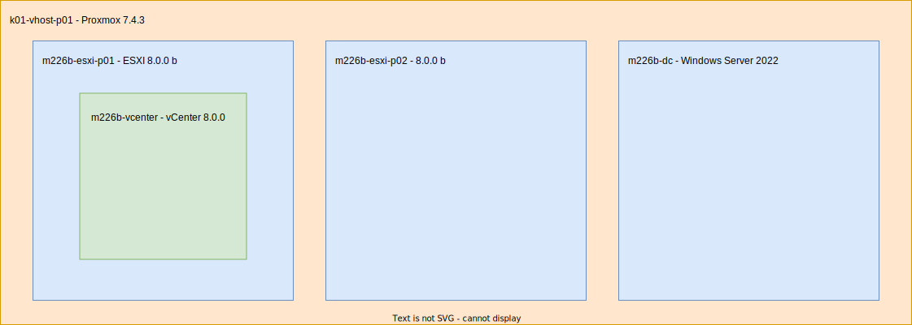

# vSphere Environment

Damit wir unsere vSolar Applikation während der Entwicklung ausgiebig testen können, haben wir wir bei uns Zuhause eine eigene vSphere Umgebung aufgebaut. Dabei haben wir beachtet, dass wir die Features: Active Directory Einbindung, VM Migration und die Erstellung diverser Netzwerksegmente im Aufbau miteinbeziehen, um eine möglichst Praxisnahe Umgebung zu erhalten.

## Verwendete Systeme

Grunstätzlich verwenden wir jeweils die neuste Version von jedem System. Die Lizenzschlüssel konnten wir entweder durch die Partnerschaften unserer Schule [Itacademy](https://itacademy.brightspace.com/d2l/login?sessionExpired=0&target=%2fd2l%2fhome) und [Azure](https://portal.azure.com) oder im Falle von ESXI, direkt beim Hersteller [VMware Customerconnect](https://customerconnect.vmware.com/evalcenter?p=free-esxi8) erwerben.

|System|Anzahl|Version|
|-|-|-|
|VMware ESXI|2x|8.0.0b|
|VMware vCenter|1x|8.0.0b|
|Windows Server|1x|2022|
|Proxmox|1x|7.4.3|

## Virtuelle Infrastruktur

Da wir keine Enterprise Hardware zur Verfügung haben, sind wir darauf angewiesen, die Umgebung mit dem Nested Virtualization Konzept aufzubauen. Glücklicherweise besitzen wir einen ressourcenstarken Baremetal und mit dem Proxmox Hypervisor lässt sich die Umgebung ohne viel Probleme virtualisieren.

## Logische Topologie

